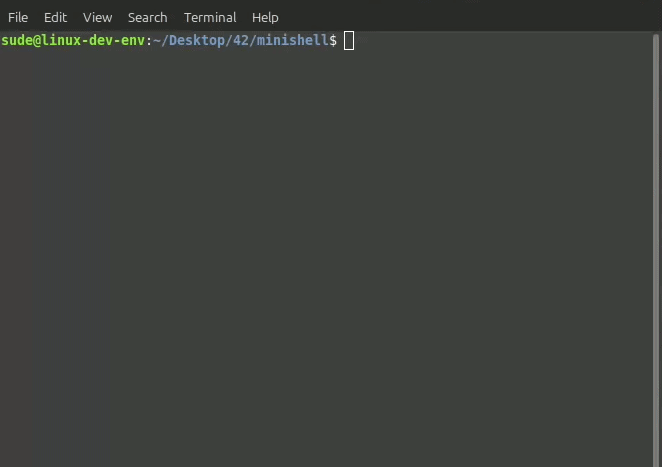

# Minishell - A custom UNIX shell implementation

<p align="center">
  
</p>

## Overview
**Minishell** is a custom UNIX shell developed from scratch in **C**. This project is a deep dive into how standard shells (like bash or zsh) process user input, interact with the operating system kernel, manage environment variables, and handle processes.

## Technical Features
* **Tokenization & Parsing:** Interprets unquoted, single-quoted `''`, and double-quoted `""` inputs correctly, handling environment variable expansions (`$VAR`).

* **Process Creation & Execution:** Utilizes `fork()`, `execve()`, and `waitpid()` to create child processes and execute system commands.

* **Piping (`|`):** Connects the output of one command to the input of the next using `pipe()` and `dup2()`.

* **Redirections (`>`, `>>`, `<`, `<<`):** Manages file descriptors for input/output redirection, including Here-Documents (`<<`).

* **Signal Handling:** Gracefully handles `Ctrl+C` (SIGINT), `Ctrl+\` (SIGQUIT), and `Ctrl+D` (EOF) mimicking bash behavior.

* **Built-in Commands:** Custom implementations of core shell commands:
  * `echo` (with `-n` flag)
  * `cd` (with relative and absolute paths)
  * `pwd`
  * `export` & `unset` (Environment variable management)
  * `env`
  * `exit`

## Installation & Compilation

The project is compiled using a standard `Makefile` and relies on the `readline` library for prompt management.

1. Clone the repository:
```bash
git clone [https://github.com/akdilsude/minishell](https://github.com/akdilsude/minishell)
cd minishell
```

2. Compile the executable:
```bash
make
```

3. Run the shell:
```bash
./minishell
```

## Directory Structure
```text
minishell/
├── assets/         # Media assets for documentation
├── inc/            # Header files
├── libft/          # Custom standard C library
├── srcs/           # Core logic (Tokenizer, Parser, Executor, Builtins)
├── Makefile        # Build automation
├── readline.supp   # Valgrind suppression file for readline memory leaks
└── README.md       # Project documentation
```